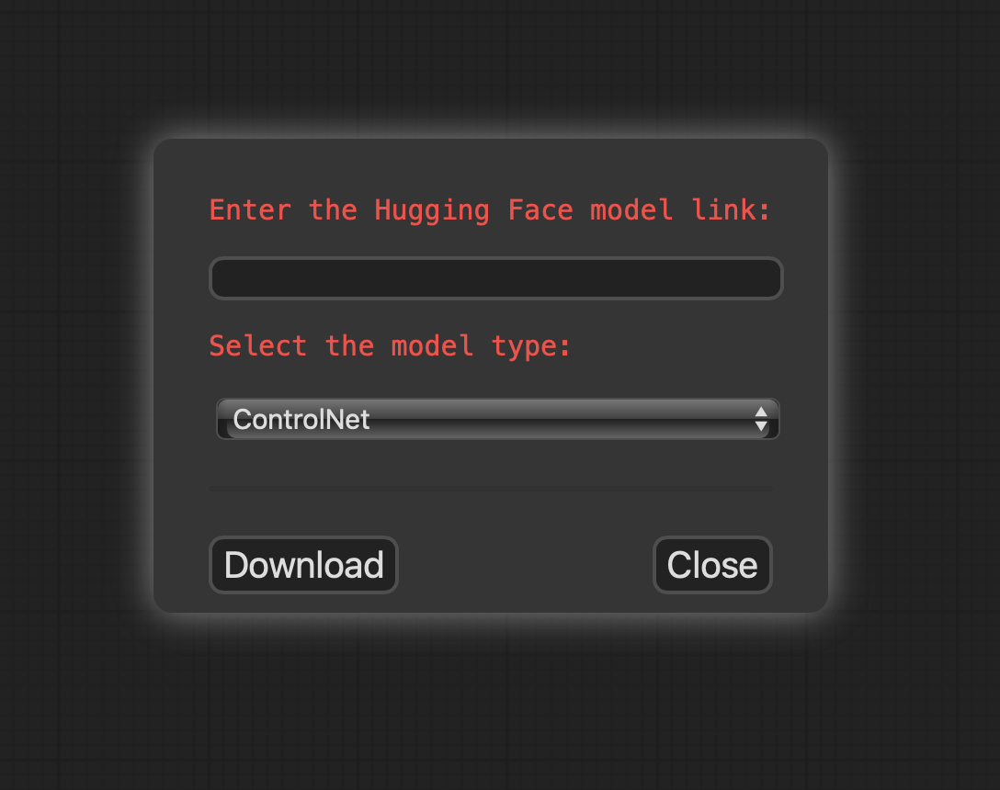

# ComfyUI-HF-Downloader

ComfyUI-HF-Downloader is a plugin for ComfyUI that allows you to download Hugging Face models directly from the ComfyUI interface.



## Requirements

- ComfyUI (latest version)

## Installation

1. Clone this repository into the `web/extensions` folder of your ComfyUI installation:

   ```bash
   cd /path/to/ComfyUI/web/extensions
   git clone https://github.com/fexploit/ComfyUI-HF-Downloader.git
   ```

2. Restart ComfyUI.

## Usage

1. Launch ComfyUI and locate the "HF Downloader" button in the interface.

2. Click on the "HF Downloader" button and enter the Hugging Face model link in the popup.

3. Select the model type (Checkpoint, LoRA, VAE, Embedding, or ControlNet).

4. Click the "Download" button and wait for the model to be downloaded.

5. Once the download is complete, the model will be saved in the `ComfyUI/models/{model-type}` folder of your ComfyUI installation.

## Troubleshooting

If you encounter any issues, please report them in the GitHub Issues section.

## Contributing

Contributions are welcome! If you have any suggestions, bug reports, or feature requests, please open an issue or submit a pull request.

## License

This project is licensed under the [MIT License](LICENSE).

## Acknowledgements

- [ComfyUI](https://github.com/comfyanonymous/ComfyUI) - A powerful and user-friendly interface for Stable Diffusion.
- [Hugging Face](https://huggingface.co/) - A platform for hosting and sharing machine learning models.

## Contact

For any questions or inquiries, please contact [your-email@example.com](mailto:your-email@example.com).
